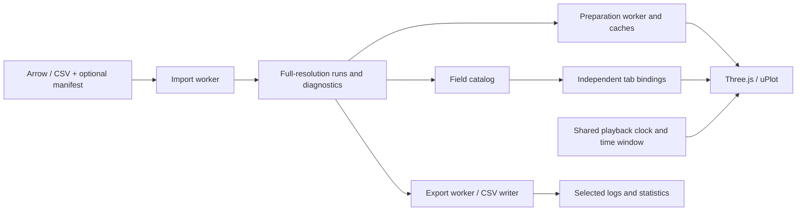

# Architecture

The React application owns shared imported runs and playback state. Tabs hold independent bindings and display settings.
Three.js renders spatial views; uPlot renders graphs. Imported logs are processed locally in the browser.

## Code map

| Area                                                                | Responsibility                                                                             |
| ------------------------------------------------------------------- | ------------------------------------------------------------------------------------------ |
| [Workbench](../src/Workbench.tsx), [components](../src/components/) | Import/run controls, tabs, field browser/dock, menus, workspace and export UI              |
| [Data](../src/data/)                                                | Decode Arrow/CSV, validate metadata, recognize signals, derive diagnostics, encode exports |
| [Playback](../src/playback/)                                        | Event indexing, interpolation/validity, global clock, alignment, window and ticks          |
| [Workspace](../src/workspace/)                                      | Field grouping, compatibility, persistence, preparation scheduling, graph/path indices     |
| [Scene](../src/scene/), [charts](../src/charts/)                    | 3D models/cameras and time-series rendering                                                |
| [Math](../src/math/)                                                | Rotations, path-distance queries, and time-weighted statistics                             |
| [Workers](../src/workers/)                                          | Import/normalization, selected-field preparation, Arrow export and analysis                |
| [Python modules](../tools/rdd2_simulation/)                         | Scenario execution, telemetry extraction, metadata, staged log publication                 |

## Data and responsiveness

Imported columns remain full-resolution Float64 arrays. Aliases and aggregate fields reference existing data rather than
duplicating it. Worker imports transfer buffers and commit a batch only when all files finish; failed/cancelled imports
leave existing runs intact.

Adding a field prepares its selected channels asynchronously and exposes progress on its dock row.
Cached graph indices answer visible-range queries without reimporting the log; display sampling preserves extrema and
gaps. Spatial preparation creates GPU-ready Float32 geometry while keeping analytical data at Float64 precision.
Removed bindings/runs release preparation work and cached resources.

Arrow export copies selected columns before transfer, preserving live run buffers. CSV uses an incremental writer.
Statistics and exported rows use original data rather than rendered samples. Whole logs are loaded into memory;
there is no lazy on-disk column query.

## Validation

| Suite                                                 | Covers                                                                                        |
| ----------------------------------------------------- | --------------------------------------------------------------------------------------------- |
| [Core](../tests/core/) (`npm test`)                   | Parsing, Arrow round trips, normalization, math, playback, preparation and workspace behavior |
| [Browser](../tests/browser/) (`npm run test:browser`) | Imports, tabs/dock interactions, graph/3D rendering, playback, persistence and export         |
| [Python](../tests/) (`npm run test:python`)           | Simulation tool, Arrow/CSV publication, provenance, failures and service behavior             |

The [Python-generated Arrow fixture](../tests/fixtures/generate_arrow.py) checks cross-language compatibility.
Optional browser artifact tests require `RDD2_GPS_TRACE` or `RDD2_RUMOCA_BUNDLE` and otherwise skip.
See the [README](../README.md#build-and-test) for commands and [CI](../.github/workflows/ci.yml) for automated checks.
